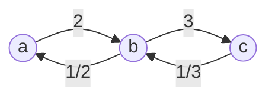

```python
class Solution:
    def calcEquation(self, equations: List[List[str]], values: List[float], queries: List[List[str]]) -> List[float]:
        def build_graph(edges, weights):
            graph = defaultdict(dict)
            for i in range(len(edges)):
                num, denom = edges[i]
                weight = weights[i]
                graph[num][denom] = weight
                graph[denom][num] = 1 / weight
            return graph
        
        def answer_query(query):
            num, denom = query
            if num not in graph or denom not in graph:
                return -1
            
            seen = {num}
            queue = deque([(num, 1)])
            while queue:
                node, result = queue.popleft()
                if node == denom:
                    return result
                
                for neighbor in graph[node]:
                    if neighbor not in seen:
                        seen.add(neighbor)
                        queue.append((neighbor, result * graph[node][neighbor]))
                        
            return -1
            
        graph = build_graph(equations, values)
        return [ answer_query(query) for query in queries ]
```

This is kind of a wild problem. It takes a *lot* of imagination to view it as a graph problem at first. The idea is that each element of a quotient (i.e., numerator and denominator) is a node. An edge *is* the ratio of numerator to denominator as well as denominator to numerator (we view the `equations` provided as an edge list of undirected edges). Each edge is *weighted* &#8212; the quotient value is the weight.

For example, if we're given that $\frac{a}{b}=2$ and $\frac{b}{c}=3$, then we can model the process of trying to solve for $\frac{a}{c}$ as a graph traversal problem:



The idea is to start at node `a`, the numerator, and try to eventually reach node `c`, the denominator, by traveling along the weighted edges. As the diagram above shows, we should have $\frac{a}{c} = 6$, which we get by starting from `a` with a product of $1$ and then multiplying it by the edge weights as we go: $1 \times 2\times 3 = 6$.

The BFS solution above is rather clean, but the DFS solution is arguably more intuitive in a sense (even though it may be slightly harder to code) because we're basically trying to determine whether or not there exists a path from the numerator to the denominator:

```python
class Solution:
    def calcEquation(self, equations: List[List[str]], values: List[float], queries: List[List[str]]) -> List[float]:
        def build_graph(edges, weights):
            graph = defaultdict(dict)
            for i in range(len(edges)):
                num, denom = edges[i]
                weight = weights[i]
                graph[num][denom] = weight
                graph[denom][num] = 1 / weight
            return graph
        
        def answer_query(query):
            num, denom = query
            if num not in graph or denom not in graph:
                return -1
            
            seen = {num}
            def dfs(node):
                if node == denom:
                    return 1
                
                for neighbor in graph[node]:
                    if neighbor not in seen:
                        seen.add(neighbor)
                        result = dfs(neighbor)
                        if result != -1:
                            return result * graph[node][neighbor]
                
                return -1
            
            return dfs(num)
            
        graph = build_graph(equations, values)
        return [ answer_query(query) for query in queries ]
```