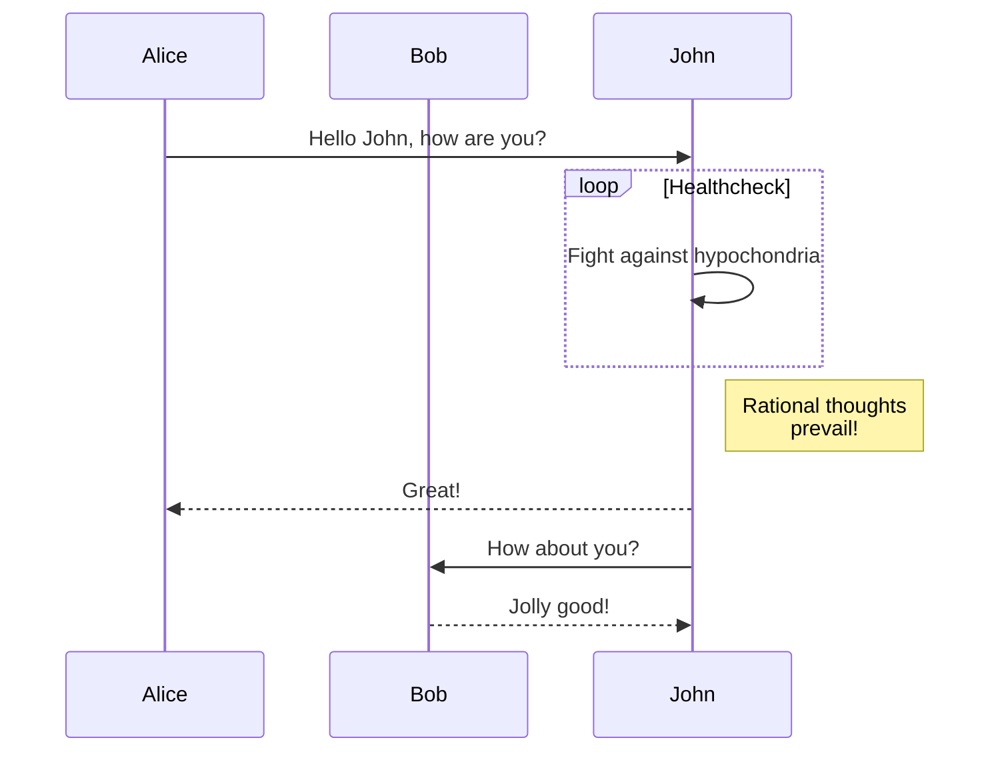
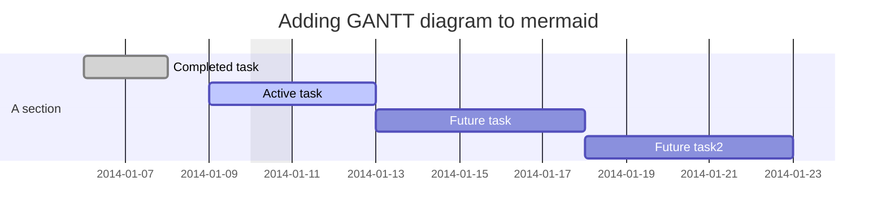
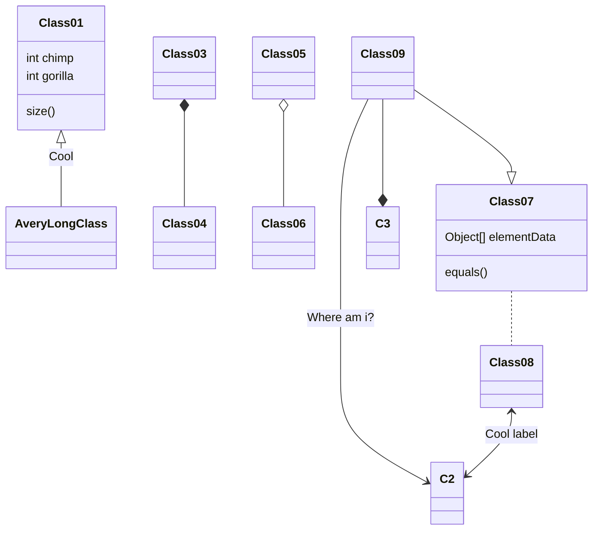
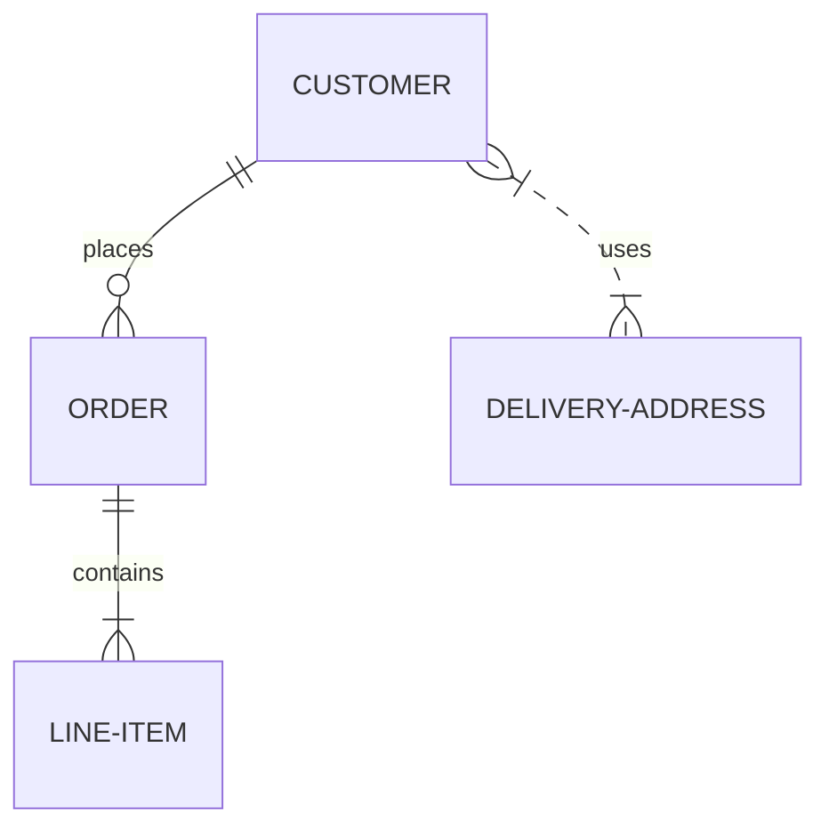
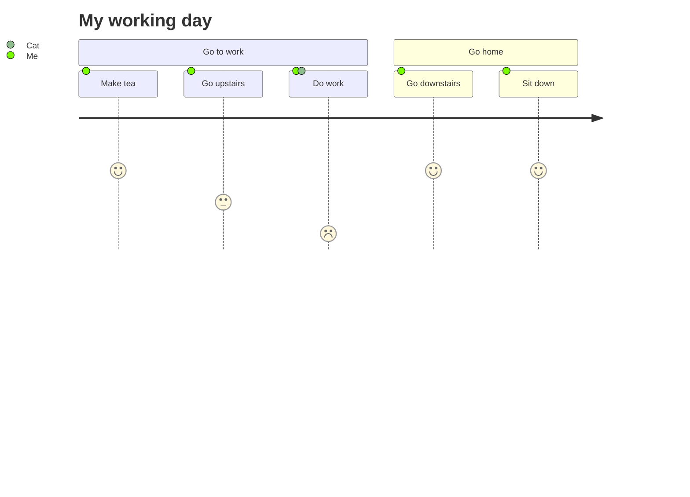

import Tabs from '@theme/Tabs';
import TabItem from '@theme/TabItem';
import TOCInline from '@theme/TOCInline';
import ImageSwitcher from '@site/src/components/ImageSwitcher';
import PartialExample from '@site/docs/_Partials/_markdown-partial-example.mdx';
import ExportCustomToolbar from '@site/src/components/CustomToolbar';
import VideoContent from '@site/src/components/VideoContent';
import ReactPlayer from 'react-player';
import AcUnitIcon from '@mui/icons-material/AcUnit';
import { orange } from '@mui/material/colors';
import Pseudocode from '@site/src/components/Pseudocode';

import sampleTextStyle from '!!raw-loader!@site/src/components/_PseudocodesSamples/_test-text-style.tex';
import sampleTestAtoms from '!!raw-loader!@site/src/components/_PseudocodesSamples/_test-atoms.tex';
import sampleTestControlBlocks from '!!raw-loader!@site/src/components/_PseudocodesSamples/_test-control-blocks.tex';
import sampleTestStatementsAndComments from '!!raw-loader!@site/src/components/_PseudocodesSamples/_test-statements-and-comments.tex';
import sampleQuicksort from '!!raw-loader!@site/src/components/_PseudocodesSamples/_test-quicksort.tex';

## Code Blocks

### Error Highlighting

**Input:**

````md
```js
const name = null;
// highlight-error-next-line
console.log(name.toUpperCase());
// Uncaught TypeError: Cannot read properties of null (reading 'toUpperCase')
```
````

**Output:**

```js
const name = null;
// highlight-error-next-line
console.log(name.toUpperCase());
// Uncaught TypeError: Cannot read properties of null (reading 'toUpperCase')
```

## Pseudocode

Default options:

```js
{
  indentSize: '1.2em',
  commentDelimiter: '//',
  lineNumber: false,
  lineNumberPunc: ':',
  noEnd: false,
  captionCount: undefined,
}
```

### Quicksort Example

**Input:**

```latex title="/src/components/_Pseudocodes/quicksort.tex"
\begin{algorithm}
\caption{Quicksort}
\begin{algorithmic}
\PROCEDURE{Quicksort}{$A, p, r$}
    \IF{$p &lt; r$} 
        \STATE $q = $ \CALL{Partition}{$A, p, r$}
        \STATE \CALL{Quicksort}{$A, p, q - 1$}
        \STATE \CALL{Quicksort}{$A, q + 1, r$}
    \ENDIF
\ENDPROCEDURE
\PROCEDURE{Partition}{$A, p, r$}
    \STATE $x = A[r]$
    \STATE $i = p - 1$
    \FOR{$j = p$ \TO $r - 1$}
        \IF{$A[j] &lt; x$}
            \STATE $i = i + 1$
            \STATE exchange
            $A[i]$ with $A[j]$
        \ENDIF
        \STATE exchange $A[i]$ with $A[r]$
    \ENDFOR
\ENDPROCEDURE
\end{algorithmic}
\end{algorithm}
```

```jsx
import Pseudocode from '@site/src/components/Pseudocode';
import qSort from '!!raw-loader!@site/src/components/_Pseudocodes/quicksort.tex';

<Pseudocode
	content={qSort}
	algID="quicksort"
	options={{ lineNumber: true, captionCount: 4 }}
/>
```

**Output:**

<Pseudocode
	content={sampleQuicksort}
	algID="quicksort"
	options={{ lineNumber: true }}
/>

## Math

### Cases

**Input:**

```latex
x = 
\begin{cases}
  a &\text{if } \\
  c &\text{if } d
\end{cases}
```

**Output:**

$$
x = 
\begin{cases}
  a &\text{if}\ b \\
  c &\text{if}\ d
\end{cases}
$$

### Matrices

#### No Braces

**Input:**

```latex
\begin{matrix}
   a & b \\
   c & d
\end{matrix}
```

**Output:**

$$
\begin{matrix}
  a & b \\
  c & d
\end{matrix}
$$

#### Parenthetical Braces

**Input:**

```latex
\begin{pmatrix}
  a & b \\
  c & d
\end{pmatrix}
```

**Output:**

$$
\begin{pmatrix}
  a & b \\
  c & d
\end{pmatrix}
$$

#### Bracket Braces

**Input:**

```latex
\begin{bmatrix}
  a & b \\
  c & d
\end{bmatrix}
```

**Output:**

$$
\begin{bmatrix}
  a & b \\
  c & d
\end{bmatrix}
$$

#### Curly Braces

**Input:**

```latex
\begin{Bmatrix}
  a & b \\
  c & d
\end{Bmatrix}
```

**Output:**

$$
\begin{Bmatrix}
  a & b \\
  c & d
\end{Bmatrix}
$$

## Tabs

### Multi-language support code blocks

**Input:**

````jsx
import Tabs from '@theme/Tabs';
import TabItem from '@theme/TabItem';

<Tabs>
<TabItem value="js" label="JavaScript">

```js
function helloWorld() {
  console.log('Hello, world!');
}
```

</TabItem>
<TabItem value="py" label="Python">

```py
def hello_world():
  print("Hello, world!")
```

</TabItem>
<TabItem value="java" label="Java">

```java
class HelloWorld {
  public static void main(String args[]) {
    System.out.println("Hello, World");
  }
}
```

</TabItem>
</Tabs>
````

**Output:**

<Tabs>
<TabItem value="js" label="JavaScript">

```js
function helloWorld() {
  console.log('Hello, world!');
}
```

</TabItem>
<TabItem value="py" label="Python">

```py
def hello_world():
  print("Hello, world!")
```

</TabItem>
<TabItem value="java" label="Java">

```java
class HelloWorld {
  public static void main(String args[]) {
    System.out.println("Hello, World");
  }
}
```

</TabItem>
</Tabs>

### Default Tab

**Input:**

````jsx
import Tabs from '@theme/Tabs';
import TabItem from '@theme/TabItem';

<Tabs>
<TabItem value="js" label="JavaScript">

```js
function helloWorld() {
	console.log('Hello, world!');
}
```

</TabItem>
<TabItem value="py" label="Python" default>

```py
def hello_world():
  print("Hello, world!")
```

</TabItem>
</Tabs>
````

**Output:**

<Tabs>
<TabItem value="js" label="JavaScript">

```js
function helloWorld() {
	console.log('Hello, world!');
}
```

</TabItem>
<TabItem value="py" label="Python" default>

```py
def hello_world():
  print("Hello, world!")
```

</TabItem>
</Tabs>

### Initially Hidden Tab Content

**Input:**

````jsx
import Tabs from '@theme/Tabs';
import TabItem from '@theme/TabItem';

<Tabs defaultValue={null}>
<TabItem value="js" label="JavaScript">

```js
function helloWorld() {
	console.log('Hello, world!');
}
```

</TabItem>
<TabItem value="py" label="Python">

```py
def hello_world():
  print("Hello, world!")
```

</TabItem>
</Tabs>
````

**Output:**

<Tabs defaultValue={null}>
<TabItem value="js" label="JavaScript">

```js
function helloWorld() {
	console.log('Hello, world!');
}
```

</TabItem>
<TabItem value="py" label="Python">

```py
def hello_world():
  print("Hello, world!")
```

</TabItem>
</Tabs>

### Synced Tab Choices

**Input:**

```jsx
import Tabs from '@theme/Tabs';
import TabItem from '@theme/TabItem';

<Tabs groupId="operating-systems">
  <TabItem value="win" label="Windows">Use Ctrl + C to copy.</TabItem>
  <TabItem value="mac" label="macOS">Use Command + C to copy.</TabItem>
</Tabs>

<Tabs groupId="operating-systems">
  <TabItem value="win" label="Windows">Use Ctrl + V to paste.</TabItem>
  <TabItem value="mac" label="macOS">Use Command + V to paste.</TabItem>
</Tabs>
```

**Output:**

<Tabs groupId="operating-systems">
  <TabItem value="win" label="Windows">Use Ctrl + C to copy.</TabItem>
  <TabItem value="mac" label="macOS">Use Command + C to copy.</TabItem>
</Tabs>

<Tabs groupId="operating-systems">
  <TabItem value="win" label="Windows">Use Ctrl + V to paste.</TabItem>
  <TabItem value="mac" label="macOS">Use Command + V to paste.</TabItem>
</Tabs>

## Admonitions

Markdown blocks of the form

```md
:::note|tip|info|caution|danger|<custom>

Content

:::
```

produce the following respectively (note for the `<custom>` choice the *type* of admonition is still specified for styling purposes):

:::note

Content

:::

:::tip

Content

:::

:::info

Content

:::

:::caution

Content

:::

:::danger

Content

:::

:::caution custom title with caution theme

Content

:::

## Video Content

### Single Video

**Input:**

```jsx
import VideoContent from '@site/src/components/VideoContent';

<VideoContent 
  type="note" 
  videoUrls={[
    'https://www.youtube.com/embed/XV-u_Ow47s0'
  ]}
>

This is a bunch of content that you can place within the video admonition. 
Even math like $\sin(x)$ can be included.

</VideoContent>
```

**Output:**

<VideoContent 
  type="note" 
  videoUrls={[
    'https://www.youtube.com/embed/XV-u_Ow47s0'
  ]}
>

This is a bunch of content that you can place within the video admonition. Even math like $\sin(x)$ can be included.

</VideoContent>

### Multiple Videos

**Input:**

```jsx
import VideoContent from '@site/src/components/VideoContent';

<VideoContent 
  type="caution" 
  title="something cool and something nice" 
  videoUrls={[
    "https://www.youtube.com/embed/cN9c_JyvL1A", 
    "https://www.youtube.com/embed/XV-u_Ow47s0"
  ]
}>

This is a bunch of content that you can place within the video admonition. 
Even math like $\sin(x)$ can be included.

</VideoContent>
```

**Output:**

<VideoContent 
  type="caution" 
  title="something cool and something nice" 
  videoUrls={[
    "https://www.youtube.com/embed/cN9c_JyvL1A", 
    "https://www.youtube.com/embed/XV-u_Ow47s0"
  ]
}>

This is a bunch of content that you can place within the video admonition. 
Even math like $\sin(x)$ can be included.

</VideoContent>

### Watch Video Directly

**Input:**

```jsx
import ReactPlayer from 'react-player';

<div className="player-wrapper">
	<ReactPlayer
		width="100%"
		height="100%"
		className="react-player"
		controls={true}
		playing={false}
		loop={false}
		volume={1}
		muted={false}
		url="https://www.youtube.com/watch?v=8aGhZQkoFbQ"
	/>
</div>
```

**Output:**

<div className="player-wrapper">
	<ReactPlayer
		width="100%"
		height="100%"
		className="react-player"
		controls={true}
		playing={false}
		loop={false}
		volume={1}
		muted={false}
		url="https://www.youtube.com/watch?v=8aGhZQkoFbQ"
	/>
</div>

## Icons

[Material-UI icons](https://mui.com/material-ui/material-icons/) can be used.

**Input:**

```jsx
import AcUnitIcon from '@mui/icons-material/AcUnit';
import { orange } from '@mui/material/colors';

The icon <AcUnitIcon className='material-icon' sx={{ color: orange[500] }} /> is kind of cool.
```

**Output:**

The icon <AcUnitIcon className='material-icon' sx={{ color: orange[500] }} /> is kind of cool.

## Partials

Partials make it possible to design different "sources of truth" for different contexts.

**Input:**

```jsx title="/docs/_Partials/_markdown-partial-example.mdx"
<span>This content concerns the following: {props.name}</span>.

<br />
<br />

| Something | Else |
| :-- | :-- |
| $O(4)$ | $O(n^2)$ |
| $O(\log n)$ | $\lg 2$| 

This content came from `_markdown-partial-example.mdx`.
```

```jsx
import PartialExample from '@site/docs/_Partials/_markdown-partial-example.mdx';

<PartialExample name="time and space complexity" />
```

**Output:**

<PartialExample name="time and space complexity" />

## Table of Contents

Table of contents entries are stored as objects with `id`, `level`, and `value` properties. For example:

```js 
{
  id: "theme-plugin-and-preset-configurations"
  level: 3
  value: "Theme, plugin, and preset configurations"
}
```

You can use this information to inform how you have table of contents menus created on your page. The formatting can be rather basic or highly customized.

### All page contents

**Input:**

```jsx
import TOCInline from '@theme/TOCInline';
<TOCInline toc={toc} />
```

**Output:**

<details><summary> See this page's full table of contents</summary>

<TOCInline toc={toc} />

</details>

### Filtered contents

**Input:**

```jsx
import TOCInline from '@theme/TOCInline';
<TOCInline toc={toc} minHeadingLevel={3} maxHeadingLevel={3} />
```

**Output:**

<details><summary> See just the h3 level headings for this page's table of contents</summary>

<TOCInline toc={toc} minHeadingLevel={3} maxHeadingLevel={3} />

</details>

### Custom contents

**Input:**

```jsx
import TOCInline from '@theme/TOCInline';

<TOCInline 
  toc={[{id: 'something-1', level: 2, value: 'Something I made up'}, ... toc.filter(({level, value}, _, arr) => level >= 3 || (level == 2 && value == 'Code Blocks')), {id: 'something-2', level: 4, value: 'Something you made up'}]}
/>
```

**Output:**

<details><summary> See a much more customized TOC for this page (including made up entries)</summary>

<TOCInline 
  toc={[{id: 'something-1', level: 2, value: 'Something I made up'}, ... toc.filter(({level, value}, _, arr) => level >= 3 || (level == 2 && value == 'Code Blocks')), {id: 'something-2', level: 4, value: 'Something you made up'}]}
/>

</details>

## Diagrams and Visualizations (Mermaid)

Check out the [Mermaid documentation](https://mermaid-js.github.io/mermaid/#/) for more details. Many capabilities are possible. Some are highlighted below:

- [Flowchart](https://mermaid-js.github.io/mermaid/#/flowchart)
- [Sequence diagram](https://mermaid-js.github.io/mermaid/#/sequenceDiagram)
- [Class Diagram](https://mermaid-js.github.io/mermaid/#/classDiagram)
- [State Diagram](https://mermaid-js.github.io/mermaid/#/stateDiagram)
- [Entity Relationship Diagram](https://mermaid-js.github.io/mermaid/#/entityRelationshipDiagram)
- [User Journey](https://mermaid-js.github.io/mermaid/#/user-journey)
- [Gantt](https://mermaid-js.github.io/mermaid/#/gantt)
- [Pie Chart](https://mermaid-js.github.io/mermaid/#/pie)
- [Requirement Diagram](https://mermaid-js.github.io/mermaid/#/requirementDiagram)

### Flowchart

**Input:**

````md

````

**Output:**


### Sequence diagram

**Input:**

````md

````

**Output:**


### Gantt diagram

**Input:**

````md

````

**Output:**


### Class diagram

**Input:**

````md

````

**Output:**


### Entity relationship diagram

**Input:**

````md

````

**Output:**


### User journey diagram

**Input:**

````md

````

**Output:**


